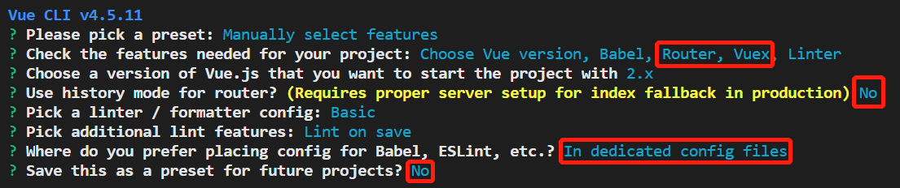
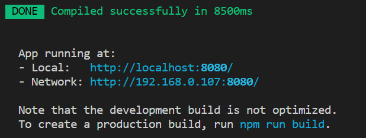
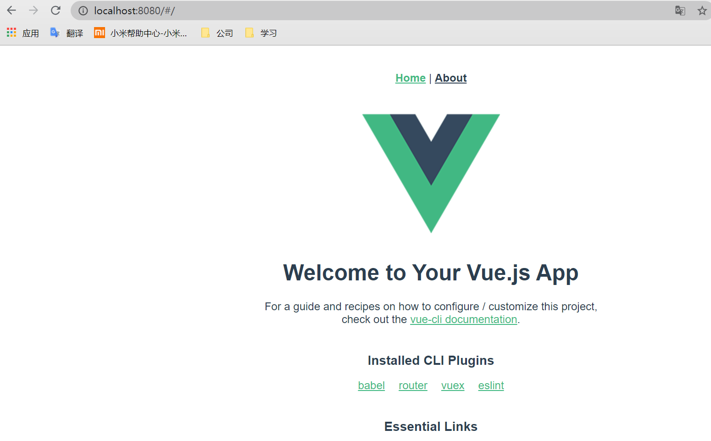

# Vue环境搭建

## 安装Node.js

node简介 Node.js是一个Javascript运行环境。实际上它是对Chrome V8引擎进行了封装。Node 是一个服务器端 JavaScript 解释器。Node.js就是服务器程序，是用来做后端的技术，不能直接用于前端开发。vue也是采用他作为配置环境，便于大型项目的开发。

```powershell
node -v
```

## Npm配置

### 安装

Npm是随同NodeJS一起安装的包管理工具，能解决NodeJS代码部署上的很多问题，常见的使用场景有以下几种：

- 允许用户从NPM服务器下载别人编写的第三方包到本地使用。
- 允许用户从NPM服务器下载并安装别人编写的命令行程序到本地使用。
- 允许用户将自己编写的包或命令行程序上传到NPM服务器供别人使用。

由于新版的nodejs已经集成了npm，所以之前npm也一并安装好了。同样可以通过输入 **"npm -v"** 来测试是否成功安装。命令如下，出现版本提示表示安装成功：

```powershell
npm -v
```

### 配置源

设置淘宝源，通过配置镜像，便于下载npm其他东西，非必须配置，打开终端输入以下命令：

```powershell
npm config set registry https://registry.npm.taobao.org
```

## 常见命令

npm config list # 查看配置

npm info vue # 查看软件包详细信息

npm view vue versions # 查询软件包所有版本

npm install vue@3.0.5 # 安装指定版本

npm install vue --save  或 npm i jquery -S     注：--save 表示 在 package.json 文件中（dependencies）记录 下载包的版本信息

npm uninstall

npm list # 查看项目中安装的软件包

npm ls vue # 查看当前安装包的版本

npm root -g # 查看全局安装包的存放位置

## 其它依赖安装

1. 安装vue

```powershell
npm install vue --save
```

2. 安装vue-cli

   Vue-cli是vue官方提供的一个命令行工具（vue-cli），可用于快速搭建大型单页应用。

```powershell
npm install -g @vue/cli
```

3. 安装webpack

   webpack 是处理模块管理、打包。

```powershell
npm install -g webpack
```

# 新建项目

1. 创建项目目录

```powershell
rd /s /q vue-demo
```

2. 创建项目

```powershell
vue create vue-demo
```




# 运行项目

```powershell
cd vue-demo
npm run serve
```

成功。





# 安装依赖

1. element-ui

   ```powershell
   npm install element-ui --save
   ```

2. axios

   ```powershell
   npm install axios --save
   ```

   