[toc]

# 1. 存储引擎

## 1. Innodb存储引擎

InnoDB，是MySQL的数据库引擎之一，现为MySQL的默认存储引擎。

innodb_page_size：根据局部性原理，每次IO以页为单位（操作系统默认4KB，innodb为16KB）。

```sql
show variables like 'innodb_page_size';
```

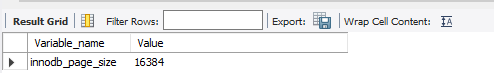

其中页的数据结果如下所示。

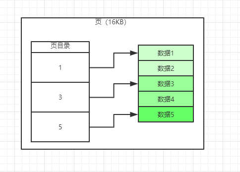

在查找数据时（单页），可以根据二分法，检索页目录，再查找对应的数据。

### 1. 索引

- 主键索引

主键索引为聚集索引，主键索引会默认排序（插入的数据会按照主键进行排序后保存在磁盘）。入插入主键字段数据3，2，1，则在保存时，会按照1，2，3进行保存，select出来的数据也是这个数据。如果没有自定义主键，则选取一个unique字段为主键，否则innodb会新增加一列rowid（隐藏列，由其它主键的情况下，不会添加该列）作为主键。

```sql
CREATE TABLE `demo` (
  `id` int(11) NOT NULL,
  `a` int(11) DEFAULT NULL,
  `b` int(11) DEFAULT NULL,
  `c` int(11) DEFAULT NULL,
  `d` varchar(45) DEFAULT NULL,
  PRIMARY KEY (`id`),
  KEY `idx_demo_a_b_c` (`a`,`b`,`c`)
) ENGINE=InnoDB DEFAULT CHARSET=utf8mb4;

insert into demo(id,a,b,c,d) value(5,4,3,2,'e');
insert into demo(id,a,b,c,d) value(4,3,2,1,'b');
insert into demo(id,a,b,c,d) value(3,2,1,5,'c');
insert into demo(id,a,b,c,d) value(2,1,5,4,'d');
insert into demo(id,a,b,c,d) value(1,5,4,3,'a');
select * from demo;
```

全表查询结果会自动按照主键（聚集）索引排序。

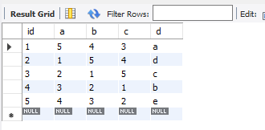

```sql
select * from demo where a >= 3;
```

过滤查询的默认结果也会按照主键（聚集）索引排序。

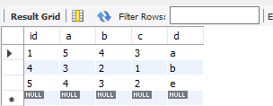

- 聚集索引

索引和数据都是集中在一起，如果表有主键，则默认聚集索引为主键索引，否则找下一个非NULL索引，如果没有其它索引，则默认以rowid为聚集索引进行保存数据。

- B+树索引

主键索引默认为B+树。Innodb默认为三层深度，如果行数据超过2000w行，则升级为四层深度（影响效率）。

聚集索引的B+树。可以看到索引和数据在一起。

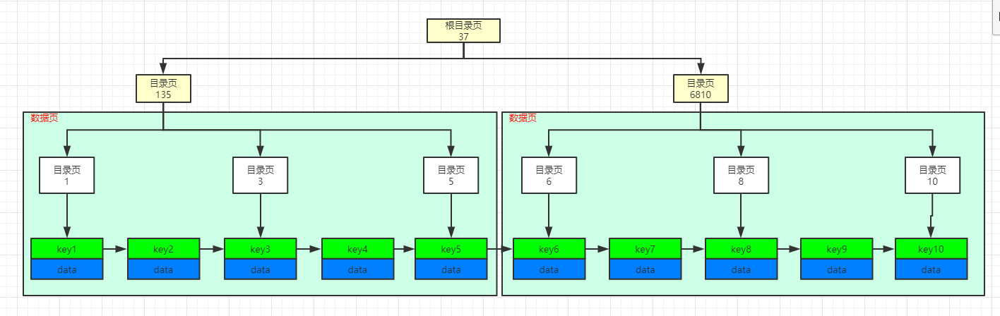

非聚集索引的B+树。可以看到索引和数据不在一起，是和主键在一起，所以要再通过主键回表，到聚集索引再查询一次，所以效率不高。

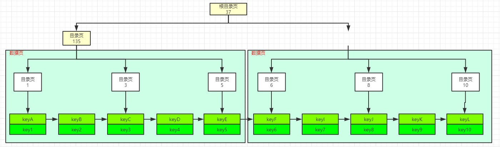

# 2. 查询优化

## 1. 开启查询优化器跟踪

由于查询优化器跟踪默认是关闭的，所以首先需要开启。

```sql
show variables like 'optimizer_trace';
set optimizer_trace = 'enabled=on';
```

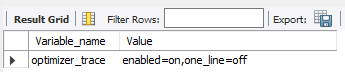

开启完毕之后，就可以通过下面的sql查询日志（在执行完毕业务查询sql之后才能执行查询日志sql）。

```sql
select * from demo where id = 3 or a = 2;
select * from information_schema.optimizer_trace;
```

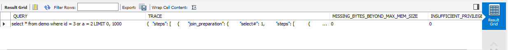

其中的trace就是下面部分。

```json
{
	"steps": [
		{
			"join_preparation": {
				"select#": 1,
				"steps": [
					{
						"expanded_query": "/* select#1 */ select `demo`.`id` AS `id`,`demo`.`a` AS `a`,`demo`.`b` AS `b`,`demo`.`c` AS `c`,`demo`.`d` AS `d` from `demo` where ((`demo`.`id` = 3) or (`demo`.`a` = 2)) limit 0,1000"
					}
				]
			}
		},
		{
			"join_optimization": {
				"select#": 1,
				"steps": [
					{
						"condition_processing": {
							"condition": "WHERE",
							"original_condition": "((`demo`.`id` = 3) or (`demo`.`a` = 2))",
							"steps": [
								{
									"transformation": "equality_propagation",
									"resulting_condition": "(multiple equal(3, `demo`.`id`) or multiple equal(2, `demo`.`a`))"
								},
								{
									"transformation": "constant_propagation",
									"resulting_condition": "(multiple equal(3, `demo`.`id`) or multiple equal(2, `demo`.`a`))"
								},
								{
									"transformation": "trivial_condition_removal",
									"resulting_condition": "(multiple equal(3, `demo`.`id`) or multiple equal(2, `demo`.`a`))"
								}
							]
						}
					},
					{
						"substitute_generated_columns": {}
					},
					{
						"table_dependencies": [
							{
								"table": "`demo`",
								"row_may_be_null": false,
								"map_bit": 0,
								"depends_on_map_bits": []
							}
						]
					},
					{
						"ref_optimizer_key_uses": []
					},
					{
						"rows_estimation": [
							{
								"table": "`demo`",
								"range_analysis": {
									"table_scan": {
										"rows": 5,
										"cost": 4.1
									},
									"potential_range_indexes": [
										{
											"index": "PRIMARY",
											"usable": true,
											"key_parts": [
												"id"
											]
										},
										{
											"index": "idx_demo_a_b_c",
											"usable": true,
											"key_parts": [
												"a",
												"b",
												"c",
												"id"
											]
										}
									],
									"setup_range_conditions": [],
									"group_index_range": {
										"chosen": false,
										"cause": "not_group_by_or_distinct"
									},
									"analyzing_range_alternatives": {
										"range_scan_alternatives": [],
										"analyzing_roworder_intersect": {
											"usable": false,
											"cause": "too_few_roworder_scans"
										}
									},
									"analyzing_index_merge_union": [
										{
											"indexes_to_merge": [
												{
													"range_scan_alternatives": [
														{
															"index": "PRIMARY",
															"ranges": [
																"3 <= id <= 3"
															],
															"index_dives_for_eq_ranges": true,
															"rowid_ordered": true,
															"using_mrr": false,
															"index_only": true,
															"rows": 1,
															"cost": 1.21,
															"chosen": true
														}
													],
													"index_to_merge": "PRIMARY",
													"cumulated_cost": 1.21
												},
												{
													"range_scan_alternatives": [
														{
															"index": "idx_demo_a_b_c",
															"ranges": [
																"2 <= a <= 2"
															],
															"index_dives_for_eq_ranges": true,
															"rowid_ordered": false,
															"using_mrr": false,
															"index_only": true,
															"rows": 1,
															"cost": 1.21,
															"chosen": true
														}
													],
													"index_to_merge": "idx_demo_a_b_c",
													"cumulated_cost": 2.42
												}
											],
											"cost_of_reading_ranges": 2.42,
											"cost_of_mapping_rowid_in_non_clustered_pk_scan": 0.1,
											"cost_sort_rowid_and_read_disk": 1,
											"cost_duplicate_removal": 0.1881,
											"total_cost": 3.7081
										}
									],
									"chosen_range_access_summary": {
										"range_access_plan": {
											"type": "index_merge",
											"index_merge_of": [
												{
													"type": "range_scan",
													"index": "PRIMARY",
													"rows": 1,
													"ranges": [
														"3 <= id <= 3"
													]
												},
												{
													"type": "range_scan",
													"index": "idx_demo_a_b_c",
													"rows": 1,
													"ranges": [
														"2 <= a <= 2"
													]
												}
											]
										},
										"rows_for_plan": 2,
										"cost_for_plan": 3.7081,
										"chosen": true
									}
								}
							}
						]
					},
					{
						"considered_execution_plans": [
							{
								"plan_prefix": [],
								"table": "`demo`",
								"best_access_path": {
									"considered_access_paths": [
										{
											"rows_to_scan": 2,
											"access_type": "range",
											"range_details": {
												"used_index": "sort_union(idx_demo_a_b_c,PRIMARY)"
											},
											"resulting_rows": 2,
											"cost": 4.1081,
											"chosen": true
										}
									]
								},
								"condition_filtering_pct": 100,
								"rows_for_plan": 2,
								"cost_for_plan": 4.1081,
								"chosen": true
							}
						]
					},
					{
						"attaching_conditions_to_tables": {
							"original_condition": "((`demo`.`id` = 3) or (`demo`.`a` = 2))",
							"attached_conditions_computation": [],
							"attached_conditions_summary": [
								{
									"table": "`demo`",
									"attached": "((`demo`.`id` = 3) or (`demo`.`a` = 2))"
								}
							]
						}
					},
					{
						"refine_plan": [
							{
								"table": "`demo`"
							}
						]
					}
				]
			}
		},
		{
			"join_execution": {
				"select#": 1,
				"steps": []
			}
		}
	]
}
```

equality_propagation：等值传递。如，where a=b and b=c and c=1，优化后则为where a=1 and b=1 and c=1。

constant_propagation：常量传递。如，where a>b and b=1，优化后则为where a>1 and b=1。

trivial_condition_removal：删除无用的条件。如，where 1=1 and a=1，优化后则为where a=1。

## 2. 基于成本

mysql查询优化会选择一个成本最低的执行方案。包含CPU和IO成本。

>Innodb存储引擎规定读取一个页的成本默认为1.0，读取以及检测一条记录是否符合搜索条件的成本默认为0.2。优化步骤

## 3. 优化步骤

通过下面的sql可以查询出表的统计信息。

```sql
show table status like 'demo' --该表的数据默认不是实时更新，默认变动记录数超过10%才更新。也可以手动更新
```

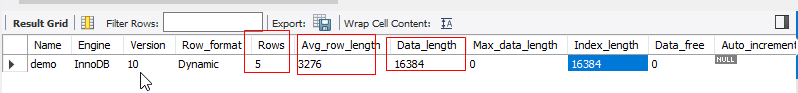

```sql
analyze table demo;
```


1. 全表扫描（table_scan）

- IO：主键（聚集）索引页数（即全表页数）=表数据大小/16KB=m页。则IO成本=m页x1.0。
- CPU：CPU成本=全表的行数x0.2=n行x0.2。

```sql
select * from demo where id = 3 or a = 2;
```

上面sql的优化器追踪。

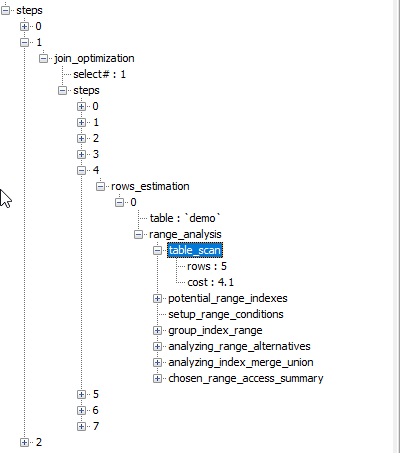

2. 索引成本

- 主键（聚集）索引成本

主键索引成本=范围区间数IO成本+范围记录数CPU成本。

范围区间数IO成本：一个范围区间成本为1，=，<，>，in等。如，where id>1 and id<3成本为1。如果in中的条件范围小于200则精确评估，否则，通过表的统计数据中的行数（rows）和唯一值个数（show index from tableName中的字段cardinality），预估唯一值对应的平均数据行数再乘以in中的取值多少。

范围记录数CPU成本（range_scan_alternatives）：该成本=范围记录数x0.2。

- 非聚集索引成本

非聚集索引成本=非聚集索引查询成本+回表成本。

回表成本：通过非聚集索引查询到的主键，再到主键索引中查询的成本。如查询非聚集索引字段where a>2，在非聚集索引中查到对应主键为1，4，5，则回表成本为where id in (1,4,5)。

最终的索引将有可能会使用成本最小的索引。最终的优化器也会比较索引成本和全表扫描成本，选择最小的执行路径。

# 3. 连接

所有表连接都需要一个驱动表和一个被驱动表。对于内连接，选取那个驱动表都是一样的；对于外连接，驱动表和被驱动表都是固定的，左连接的驱动表是左边的表，右连接的驱动表是右边的表。

连接的大致原理：

- 选取驱动表，使用与驱动表相关的过滤条件，选择最低成本的查询方式对驱动表查询；

- 对上面步骤中的查询结果集中的每条结果，都分别到被驱动表中查找匹配的记录。对应的伪代码如下所示。

  ```sql
  foreach row i in driveTableRows    // 遍历满足条件的驱动表每条记录
  	foreach row j in drivemTableRows // 遍历被驱动表中满足驱动表中的每条记录（on 条件）
  		if rowi.id == rowj.id 
  			result.add rowj
  ```

  如，select * from t1 join t2 on t1.id=t2.id，等价于下面的sql的合集。

  ```sql
  select * from t2 where t2.id=1;
  select * from t2 where t2.id=2;
  select * from t2 where t2.id=3;
  select * from t2 where t2.id=4;
  select * from t2 where t2.id=5;
  ```

## 1. 原理

### 1. 基于块的嵌套连接算法

基于上面的原理，mysql由join_buffer_size的概念。可以每次从驱动表中获取256KB（16页）的数据，再从驱动表中匹配。这样就是基于块的嵌套查询，减少IO降低成本。如下所示。

```sql
select * from t2 where t2.id in (1,2,3,4,5);
```

### 2. JOIN_BUFFER

join_buffer_size就是没有驱动表加载的最大大小。

### 3. 小表驱动大表

根据连接的原理可以看出，如果小表为驱动表有n条记录，大表为被驱动表有m条记录（m>>n）。那么驱动表的每条记录都需要在被驱动表中匹配查询一次，那就是n次，反之，则为m次。在内连接查询中，查询优化器会自动选择最优的驱动方式。

```java
foreach row n in driveTableRows    // 遍历满足条件的驱动表每条记录
	foreach row n in drivemTableRows // 遍历被驱动表中满足驱动表中的每条记录（on 条件）
		if rown.id == rowm.id 
			result.add rowm
```

## 2. 优化

### 1.增大JOIN_BUFFER

最好能够让驱动表一次可以加载完毕。

>默认join_buffer_size的大小为256KB，最小可以设置为128B。

```sql
show variables like 'join_buffer_size';
```


### 2. 外连接消除

转换为内连接，可以让查询优化器自主选择最优的驱动表。

由于外连接的驱动表和被驱动表是固定的，而内连接的表的驱动表和被驱动表可以根据成本调整。所以外连接无法优化表的连接顺序。

外连接和内连接的本质就是：**对于外连接的驱动表来说，如果无法在被驱动表中匹配on条件中的记录，那么该记录会以全NULL值填入到结果集。而内连接驱动表中的记录如果无法在被驱动表中找到匹配on条件中的记录，那么该记录就会丢弃。**

如，select * from t1 left join t2 where t1.id = t2.id结果为

| a    |      | a    |      |
| ---- | ---- | ---- | ---- |
| 1    | ……   | 1    | ……   |
| 2    | ……   | 2    | ……   |
| 3    | ……   | null | null |

如果该sql可以从**业务**上优化为select * from t1 left join t2 where t1.id = t2.id where t2.b is not null，则会减少不匹配的记录，并且优化器可以消除外连接，优化改为内连接方式（可以从执行计划看出）。

```sql
explain select * from demo t1 left join demo1 t2 on t1.id = t2.id;
```

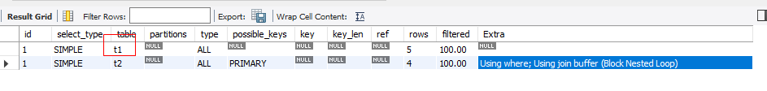

```sql
explain select * from demo t1 left join demo1 t2 on t1.id = t2.id where t2.a is not null;
```

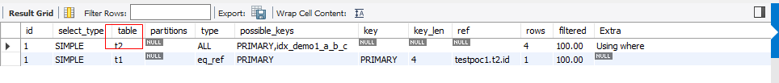

# 4. 子查询

## 1. 按照结果集区分子查询

子查询主要有两种写法。

```sql
// 1. 子查询在where过滤条件中
select * from demo where id in (select id from demo1);
// 2. 子查询在from派生表中
select * from (select * from demo1) as t;
```

### 1. 过滤条件子查询

#### 1. 非相关子查询

非相关子查询，就是在子查询内部没有使用或者依赖外部的关联条件。

- 标量子查询

```sql
// 子查询结果集是个常量（标量）
select * from demo where id = (select max(id) from demo);
```

- 行子查询

```sql
// 子查询是一行数据
select * from demo where (a,b) = (select a,b from demo limit 1);
```

对于非相关标量子查询和行子查询，先执行子查询，再把子查询结果带入到where条件中查询。

- 列子查询

```sql
// 子查询结果为一列数据
select * from demo where id in (select id from demo);
```

- 表子查询

```sql
// 子查询结果是个表
select * from demo where (a,b) in (select a,b from demo);
```

#### 2. 相关子查询

相关子查询，就是子查询内部使用或依赖外部查询的关联条件。

如下为相关列子查询。

```sql
select * from demo t1 where id in (select id from demo t2 where t2.id = t1.id);
```

#### 3. 不相关子查询优化

相关标量和行子查询的执行步骤：

1. 从外层查询中获取一条记录；
2. 把上面步骤中的记录传入到内层子查询，然后执行子查询；
3. 最后，将上面子查询的结果和where条件匹配，如果匹配成功，则加入到结果集；
4. 再执行步骤1，以此类推。

对于in子查询（列和表子查询）的执行，有可能存在问题。如，子查询结果太大，内存不足；或者外层的in语句中条件过多，导致无法使用索引，最终走向了全表扫描，并且in语句的匹配过程过慢。这样子必然要对其进行优化。

对于不相关子查询（列和表子查询）的执行优化步骤：

1. 现将子查询结果放到临时表中（如果不大于tmp_table_size或者max_heap_table_size，则为内存表，使用memory引擎，hash索引；否则为物化为磁盘表，而且索引为全字段B+树索引）；
2. 把临时表中的数据进行全字段去重（可选步骤，如果查询字段为主键或者unique字段，则不需要）；
3. 外层使用join查询；

可以查看执行计划和join基本一致。

```sql
explain select * from demo where (a,b) in (select a,b from demo1);
```

从下图可以看出是demo1表驱动demo表。

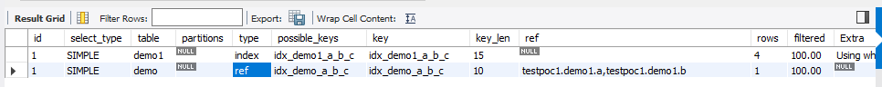

- tablePullOut（子查询的表上来）

如果in子查询关联条件为主键或者唯一索引，则优化器会直接优化为join。

```sql
explain select * from demo where id in (select id from demo1);
```

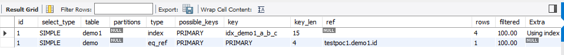

优化器优化后，等价于下面sql。

```sql
explain select * from demo t1 join demo1 t2 on t1.id = t2.id;
```

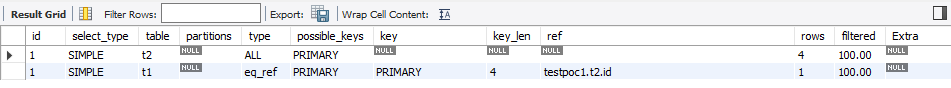

- DuplicateWeedout execution strategy（重复值消除）

如果in子查询关联条件不是唯一字段，如，select * from demo where a in (select a from demo1)，且a不是唯一性字段。我们可以建立临时表create table temp(a primary key)；将子查询的表插入到该临时表中去，如果插入失败，则做为重复记录丢弃，最终临时表则为排重后的子查询的数据。这种使用临时表消除**semi-join**（半连接）结果集中重复值的方式就是DuplicateWeedout 。

- firstMatch（首次匹配）

就是先取一条外层查询中的记录，然后在子查询中查询符合条件的记录，如果找到一条就返回，避免更多的查询；然后从外层在获取一条查询记录继续前面的步骤。

- looseScan（松散索引扫描）

利用子查询中的索引（树），不返回重复记录的结果集。

#### 4. 相关子查询优化

- 使用exists

如下sql的优化。

```sql
select * from demo t1 where id in (select id from demo t2 where t2.id = t1.id);
// 可以优化为
select * from demo t1 where exists in (select 1 from demo t2 where t2.id = t1.id);
```


### 2. 临时表子查询

```sql
select * from demo t1, (select * from demo1) as t2 where t1.id=t2.id;
```

执行方式：

- 派生表物化

将派生表先物化为临时表（如果不大于tmp_table_size或者max_heap_table_size，则为内存表，使用memory引擎，hash索引；否则为物化为磁盘表，而且索引为全字段B+树索引），再和其它表join。

```sql
create table t2 as select * from demo1;
select * from demo t1 join t2 on t1.id=t2.id;
```

- 取消派生表

对于没有意义的派生表直接去除。

```sql
select * from (select * from demo1) as t1;
// 转化为下面的sql
select * from demo1;

select * from demo t1, (select * from demo1 where a=1) as t2 where t1.id=t2.id;
// 转化为下面的sql
select * from demo t1 join demo1 t2 on t1.id=t2.id where t1.a=1;
```

但是如果派生表中包含有聚合函数，分组函数，union，limit的语句则不能直接优化。

# 5. explain原理

explain执行之后的结果集字段：

| 列名              | 描述                                                         |
| ----------------- | ------------------------------------------------------------ |
| id                | 在一个大的查询语句中，每个select关键字，对应一个唯一的id     |
| select_type       | select关键字对应的查询类型。最常见的值包括SIMPLE、PRIMARY、DERIVED 和UNION。其他可能的值还有UNION RESULT、DEPENDENT SUBQUERY、DEPENDENT UNION、UNCACHEABLE UNION 以及UNCACHEABLE QUERY。 |
| table             | 表名                                                         |
| partitions        | 匹配到的分区信息                                             |
| **type**          | 针对单表的访问方式。从最佳到最差排序，NULL（直接得到结果）>system（表只有一行，innodb没有）>const（匹配到唯一性的一行，唯一索引等值匹配）>eq_ref（主键或唯一性索引查找）>ref（非唯一行索引查找）>range（范围查找）>index（索引数扫描）>All（全表扫描） |
| **possible_keys** | 可能用到的索引                                               |
| **key**           | 实际用到的索引                                               |
| **key_len**       | 实际用到的索引长度（使用到索引的所有字段的长度，如索引idx_abc，如果where a=1 and b=1，则实际使用到的索引的长度为列a+b的长度之和）。可以为NULL的列，在定义列长度的基础上加1字节，varchar类型还要加上2字节（存储变长字符串的长度）。 |
| ref               | 当使用索引列等值查询时，与索引列进行等值匹配的对象信息（含常量） |
| rows              | 预估的记录条数或者索引扫描的行数                             |
| filtered          | 过滤之后的符合条件的记录条数的百分比                         |
| **extra**         | 一些额外信息                                                 |
|                   |                                                              |

由于执行计划是使用默认查询优化器的结果，如果需要参考其它执行路径的执行情况，可以手工指定设置查询优化器。

```sql
// 手工指定索引
explain select * from demo1 <use|force> index(idx_demo1_abc) where c=1;

// 手工指定驱动表
explain select * from demo1 t1 straight join demo2 t2 on t1.id=t2.id;
```


# 6. 通用优化方式

- in语句中的值不宜超过200个，如果不超过200个会使用精确预估成本，如果超过200个会通过统计表中的平均唯一字段行数预估（总记录行数/列的唯一值个数=每个唯一值的平均对应行数），能用between就不要用in，因为between只是一个范围查询；
- select的结果集尽量不要使用*，防止过多的成本，明确字段会增加使用覆盖索引（using index）的可能性，降低回表成本；
- 只需要一行数据时，使用limit；
- 排序或者分组时，使用索引字段，因为索引字段是排好序的；
- or可以使用union或者union all替换，可以使用更多的索引；
- in可以使用exists，检查是否使用到索引；
- 合理的分页，减少数据（分页页码越大，成本越高，也就越慢），或者考虑配合主键过滤；

如，

```sql
select * from demo1 limit 1000,100;
// 可以优化为下面的sql
select * from demo1 where id > 1000 limit 100;
```

- 不建议使用%前缀模糊匹配，因为使用不到索引；
- 不要使用隐式的类型转化（字符串转换为数值型就是0，字符串索引字段如果和数值配置，不会用到索引，反之则可以）；

```sql
// 可以查看转化告警
show warnings;
```

- 避免在where子句中使用字段表达式操作；
- 对于联合索引遵循最左前缀原则；

```sql
// 如联合索引idx_abc
select * from demo1 where b = 1;// 不走索引
select * from demo1 where b = 1 and c = 1;// 不走索引
select * from demo1 where a = 1 and b = 1 and c =1;// 不走索引
//  这是因为联合索引的B+树的目录是以a字段开头，b次之，c最后，所以可以用a**匹配，但是不能用*bc匹配。
```


- 联合查询如果使用between，<，>等范围查询，会导致索引字段失效；
- 优先使用内连接，少用外连接，连接时，使用小表驱动大表；

# 7. 事务

## 1. 事务特性

事务具备ACID四大特性：

- 隔离性（I）：连个事务不相互影响；
- 持久性（D）：事务提交后，影响是持久的，不会消失。
- 原子性（A）：不可分割，要么全部操作成功，要是全部操作失败；
- 一致性（C）：事务影响的各个因素是保持一致的。

## 2. 事务控制

1. 自动提交

事务是默认开启的，而且默认是每条执行语句一个事务，每条语句执行完毕自动提交。

```sql
show variables like 'autocommit';
```

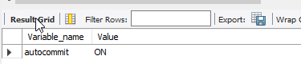

2. 手动开启并提交

如果需要手动开启事务，则需要命令来控制。

```sql
begin; // 或者start transaction;
update xxx;
insert into table xxx;
commit;// 或者rollback;
```

3. 隐式提交

如果手动开启事务之后，遇到DDL等语句就会自动提交事务。

```sql
begin; // 或者start transaction;
update xxx;
alter table | drop table | drop table | create table | create user | grant user | set password | lock table | check index | analyze table | load data | flush |  …… // 在此，会导致自动提交事务
insert into table xxx;
commit;// 或者rollback;
```

4. 保存点

有时候在事务内部需要手工设置回滚的位置，这个位置就是保存点。

```sql
begin; // 或者start transaction;
update xxx;
savepoint update1;
insert into table xxx;
savepoint insert1;
rollback to update1;
release savepoint insert1;// 可以通过这条语句删除某个保存点
commit;
```

## 3. 隔离性

事务的隔离级别：

- 未提交读（READ-UNCOMMITED）：事务内部还没有提交的变化，可以被其它事务或者会话读取到变化，会导致脏读；
- 已提交读（READ-COMMITED）：事务提交后，其它事务才能读取到，会导致不可重复读（第一次读，和后面读的数据不是相同的数据）和幻读；
- 可重复读（REPEATABLE-READ）：事务提交后，其它后面**开启**的事务才读读取到。也就是在一个事务内部，无论其它事务是否在修改数据，它读到的数据都是一样的，也就是可重复读。但是可能出现幻读（mysql在该级别不会出现幻读）。
- 串行化（SERIALIZABLE）：对一条相同记录的读写是串行的，不会有多个事务的同时操作，会降低数据库的并发性。

>脏读：读取到的数据是个没有提交的中间数据；
>
>不可重复读：在一个事务内部，没有读取同一条记录的数据值是不一样的，这是因为其它事务也有可能修改该条记录并提交，在其它事务提交之后，这个事务再次获取该记录的数据，会导致每次获取到的数据值不一致。
>
>幻读：在一个事务内部，每次查询的数据量是不一样的，这是因为其它事务也有可能插入或者删除提交数据，在其它事务提交之后，这个事务再次获取数据，会导致没有获取到的数据量不一致。

mysql-5.7默认的事务隔离级别为REPEATABLE-READ。

## 4. 版本链

使用innodb存储引擎的表，在它的聚集索引记录中包含两个隐藏列：

- tx_id：每次针对该条记录变动时，会将对应的事务id写入该列；
- roll_pointer：每次针对该条记录变动时，会将该条记录修改前的记录指针写入该列。

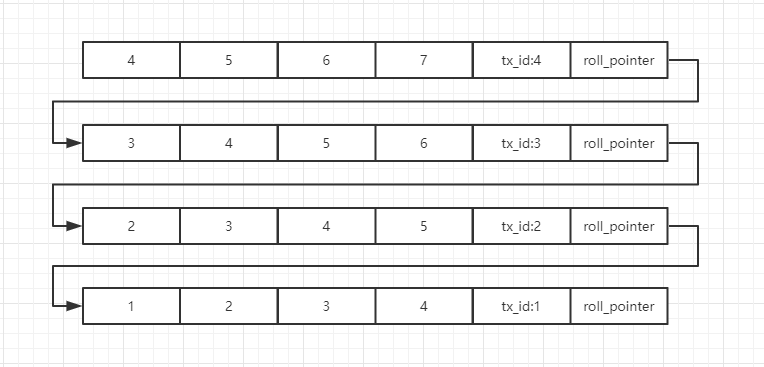

## 5. readView

1. 未提交读

每次读取版本链中最新的数据记录即可。

2. 提交读

每次select都会记录未提交事务的*m_ids[]（tx_id）数组（不包含自己的事务id），将版本链中最新的已提交的记录读取出来（判断不在m_ids中的记录）。这样子m_ids就是动态变化的，每次可以获取到最新的提交记录数据（如果当前事务修改过，那当然读取到自己的记录版本）。

3. 可重复读

只在第一次select的时候会记录未提交事务的*m_ids[]（tx_id）数组（不包含自己的事务id），将版本链中最新的已提交的记录读取出来（判断不在m_ids中的记录）。下次select时，不会刷新m_ids，所以每次获取的数据时一致的。

以上就是MVVC（Multi-Version Concurrency Controller，多版本并发控制）机制，提交读在每次读的时候都会生成一个ReadView，可重复读只有在第一次读的时候生成ReadView，之后的读就是重复这个ReadView。MVVC提高了并发性，避免加锁。

# 8. 锁

## 1.读锁与写锁

- 读锁：共享锁，shared loacks，s锁，加入读锁后，还可以加入写锁；

- 写锁：排它锁，exclusive locks，x锁，加入写锁后，不能加入读锁。

|      | 读   | 写   |
| ---- | ---- | ---- |
| 读锁 |      | 冲突 |
| 写锁 | 冲突 | 冲突 |

### 1. 读操作

innodb中，普通select是不加锁的。如果加入需要手动加锁。

```sql
select * from demo lock in share mode; // 加入读锁（事务完毕后自动解锁），会阻塞其它事务的写操作。
select * from demo for update; // 加入写锁（事务完毕后自动解锁），会阻塞其它事务的读写操作。
```

### 2. 写操作

- delete：删除一条数据时，先加入写锁，再删除之；
- insert：插入一条数据时，会加**隐式锁**（因为不存在数据，所以不可能显式的在数据上加锁，再别的delete和update时才加锁），在提交之前不被其它事务访问；
- update：
  - 如果被更新的列，修改前后没有存储空间的变化，那么会对该记录加写锁，再修改；
  - 如果被更新的列，修改前后有存储空间的变化，那么会对该记录加写锁，删除记录后，在insert。

## 2. 行锁与表锁

根据锁的范围可以划分为行锁和表锁。

查看锁情况的sql。

```sql
select * from information_schema.innodb_trx;// 记录当前运行的事务
select * from information_schema.innodb_locks;// 记录当前出现的锁
select * from information_schema.innodb_lock_waits;// 记录锁等待的记录关系
```

### 1. 行锁

- lock_rec_not_gap：单行锁；
- lock_gap：间隙锁，锁定一个范围，但不包含记录本身。目的是，是为了防止同一事务的两次当前读，出现幻读的情况；
- lock_ordinary：锁定一个范围，并包含锁本身。对于行查询，都是采用该方式，主要目的是结果幻读的问题。

#### 1. 间隙锁

1. 提交读

- 主键索引

在加锁的过程中，如果走的是主键，会之间将聚集索引树的记录加锁；

- 普通索引

如果是非聚集索引，被把非聚集索引树上的记录加锁，再回表到聚集索引树上二次加锁；

- 无索引

如果不走索引，则会将所有记录加锁，然后根据条件释放部分没有匹配到的记录。

2. 可重复读

对于可重复读的隔离级别，走主键索引和普通索引和提交读是一样的。

- 无索引

在锁住某些记录行之后，会使用到间隙锁，锁定范围内部和两端，这样子会解决**幻读**的问题。

```sql
//session1
begin;
select * from demo where a between (3, 5) for update;
3
4
5

//session2
begin;
insert into demo values(2);// 阻塞
insert into demo values(3.1);// 阻塞
insert into demo values(5.1);// 阻塞
```

如果是select * from demo，没有任何过滤条件，会锁所有记录和间隙，相当于锁表，不能插入任务记录。


### 2. 表锁

对表执行select，insert，update和delete时，innodb不会加表级别的读写锁。但是，对表执行drop，alter这些ddl语句时，其它的dml语句会阻塞，反之dml也会阻塞ddl。这个过程是使用表的元数据锁（metadata locks，简称MDL）,并没有使用表级别的读写锁。

#### 1. 表级别的锁

```sql
lock tables demo1 read;// 对表加表级别读锁
lock tables demo1 write;// 对表加表级别写锁
```

>不建议上面的表级别加锁，因为innodb的优点就是行锁，性能更高。
>
>如果行数据有写锁，则加入表级别的读锁会阻塞。

#### 2. IX,IS锁

IX：意向排它锁，如果行中有写锁，则会在表上加写意向锁，如果给表加读锁会wait；

IS：意向共享锁，如果行中有读锁，则会在表上加读意向锁。

通过意向锁可以判断表是否可以加上读写锁。

#### 3. Auto-Inc锁


- 对于表中存在自增字段，在插入记录时，会给表上加上自增锁，然后给自增列分配自增值，其它事务的insert会阻塞，这样就可以保证自增序列的连续性；
- 或者使用轻量级锁，在插入数据时，获取自增序列取值的时候，尝试获取该锁，获取到锁之后就可以获取到自增序列的值，然后是否锁，不能等待插入成功。可能导入插入失败，导致序列不连续，或者插入顺序乱序。

系统变量innodb_autoinc_block_mode:

- 0：采用auto-inc锁；
- 2：采用轻量级锁；
- 1：这是默认配置。如果插入的记录数不确定条数时，采用auto-inc；当插入记录数确定时，用轻量级锁。

```sql
show global variables like 'innodb_autoinc_lock_mode';
```

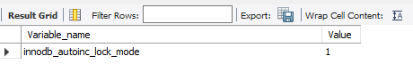

### 4. 悲观锁

使用的数据库的行锁，认为数据库会发生并发冲突，直接预先将数据锁住，其它事务阻塞，知道提交完毕后释放。

### 5. 乐观锁

在不会锁定数据的情况下更新数据，如果发现冲突，不进行更新（回滚）。一般通过version字段来实现。

### 6. 死锁

#### 1. 机制

如果事务1锁住记录1，事务2锁住记录2，事务1删除记录2（阻塞），事务2删除记录1（阻塞）。

#### 2. 死锁检测

- innodb_deadlock_detect：控制打开死锁检测，默认打开；
- innodb_lock_wait_timeout：等待锁的超时时间，默认50s；
- innodb_print_all_deadlocks：将所有死锁的日志写入到mysql错误日志中，默认关闭。

检测到死锁之后，innodb会在导致死锁的事务中选择一个权重较小的事务回滚 ，这个权重值可能由该事务影响（增删改）的记录行决定。

```sql
show engine innodb status;// 查看死锁日志。
```


#### 3. 避免死锁

- 以固定顺序访问表和数据行；
- 大事务拆分为小事务；
- 事务内部，一次锁定需要的资源；
- 降低事务隔离级别；
- 给表添加合理的索引（避免全表扫描并加锁，防止间隙锁）；

