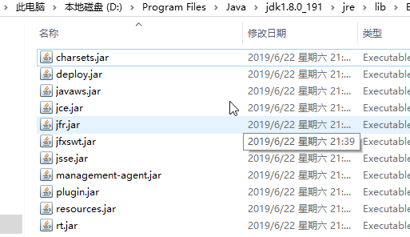
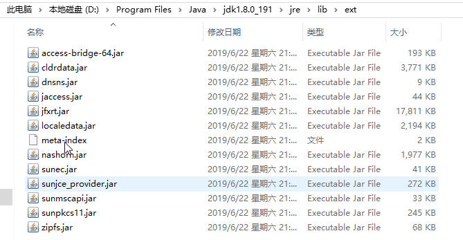
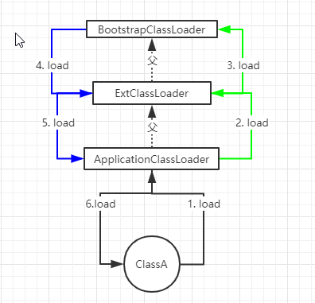
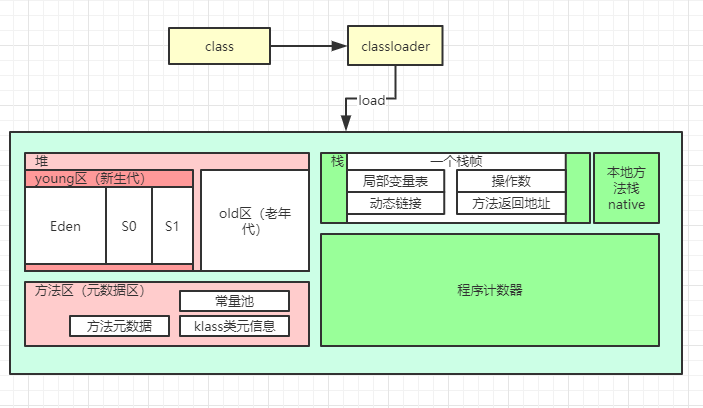
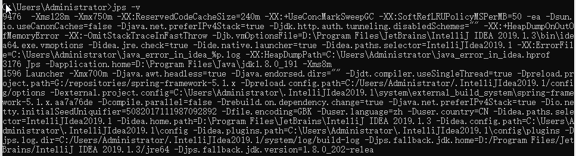
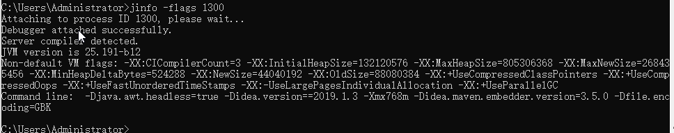
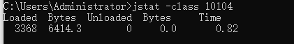
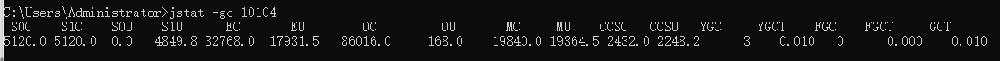
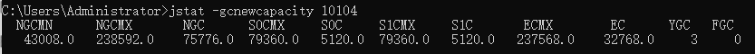
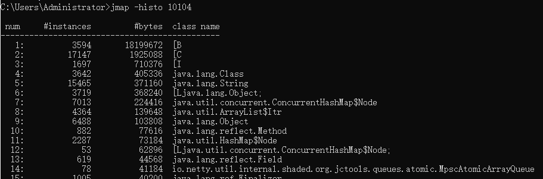

[toc]

# 1. jvm类加载机制

## 1. 类加载器

在jvm的类加载机制中，主要存在三类默认的类加载器，BootstrapClassLoader，ExtClassLoader，AapplicationClassLoader，并且存在父子关系。

- 根加载器（BootstrapClassLoader，由c/c++语言，java不可见）：负责装载jre的核心类型，如jre目录下的rt.jar，charsets.jar等。

  

- 扩展类加载器（ExtClassLoader）：负责装载jre下扩展jar包，ext/**.jar。

  

- 应用程序类加载器（ApplicationClassLoader）：负责装载应用程序的class或者依赖的jar。

## 2. 双亲委派机制

下图就是双亲委派机制（父类委托）。

 

源码分析。

```java
// java.lang.ClassLoader#loadClass(java.lang.String, boolean)
protected Class<?> loadClass(String name, boolean resolve)
    throws ClassNotFoundException
{
    synchronized (getClassLoadingLock(name)) {
        // 判断当前类是否已经加载（先从缓存开始查找）
        // First, check if the class has already been loaded
        Class<?> c = findLoadedClass(name);
        if (c == null) {// 没有加载
            long t0 = System.nanoTime();
            try {
                if (parent != null) {
                    // 调用父类的loadClass
                    c = parent.loadClass(name, false);
                } else {
                    c = findBootstrapClassOrNull(name);
                }
            } catch (ClassNotFoundException e) {
                // ClassNotFoundException thrown if class not found
                // from the non-null parent class loader
            }
			// 如果从父加载器中获取的为null
            if (c == null) {
                // If still not found, then invoke findClass in order
                // to find the class.
                long t1 = System.nanoTime();
                // 从当前类加载器中加载
                c = findClass(name);
                // this is the defining class loader; record the stats
                sun.misc.PerfCounter.getParentDelegationTime().addTime(t1 - t0);
                sun.misc.PerfCounter.getFindClassTime().addElapsedTimeFrom(t1);
                sun.misc.PerfCounter.getFindClasses().increment();
            }
        }
        if (resolve) {
            resolveClass(c);
        }
        return c;
    }
}
```


## 3. 全盘负责委托机制

是指当一个ClassLoader装载一个类时，除非显示的指定使用另外一个ClassLoader，该类所依赖及引用的所有类也有这个ClassLoader加载，同时使用委托机制，从父ClassLoader开始装载。

```java
// 复写系统String类
package java.lang;

public class String {
	public void method()
	{
	}
	public static void main(String[] args) {
		new String().method();
	}
}
```

执行报错。这是因为当前ApplicationClassLoader在加载java.lang.String类时，先委托ExtClassLoader，再委托BootstrapClassLoader进行加载，而根装载器可以装载到jre的java.lang.String类，而该类没有main方法，所有导致程序报错。

```txt
错误: 在类 java.lang.String 中找不到 main 方法, 请将 main 方法定义为:
   public static void main(String[] args)
否则 JavaFX 应用程序类必须扩展javafx.application.Application

Process finished with exit code 1
```

> 注意：不同类加载器就算加载相同的类，也会生成不同的对象，这是因为加载时机不同，或者路径不同，导致类的元数据不同，使得类对象由不同的代码或者行为。

## 4. 自定义类加载器

自定义类加载器可以打破双亲委派机制，可以通过自定义类加载器实现热加载替换class文件。

```java
public class CustomerClassLoader extends ClassLoader {
	private static final String rootPath = CustomerClassLoader.class.getResource("/").getPath();;
	private static final String path = "org/xxx/HotDeploy";
	@Override
	public Class<?> loadClass(String name) throws ClassNotFoundException {
		Class<?> c = null;
        // 每次只加载包含xxx的自定义类，其它类还是通过双亲委派由其它系统默认类加载器加载。
		if(name.contains("xxx"))
		{
			c = findLoadedClass(name, true);
		}
		if(null == c)
		{
			c = getSystemClassLoader().loadClass(name);
		}
		return c;
	}

	public Class<?> findLoadedClass(String name, boolean resovler){
		String fullPath = rootPath + path + ".class";
		File classFile = new File(fullPath);
		byte[] bytes = new byte[(int) classFile.length()];
		try {
			InputStream inputStream = new FileInputStream(classFile);
			inputStream.read(bytes);
			inputStream.close();
		} catch (FileNotFoundException e) {
			e.printStackTrace();
		} catch (IOException e) {
			e.printStackTrace();
		}

		Class<?> defineClass = defineClass(name, bytes, 0, bytes.length);
		return defineClass;
	}
	public static void main(String[] args) throws ClassNotFoundException, InterruptedException {

		String fullPath = rootPath + path + ".class";
		System.out.println(fullPath);
		while(true) {
            // 每次循环必须new一个全新的类加载器，否则同一个类加载器重复加载会报异常（loader (instance of  xxx): attempted  duplicate class definition for name）
			CustomerClassLoader loader = new CustomerClassLoader();
			loader.loadClass("org.xxx.HotDeploy");
			new HotDeploy().method();
			TimeUnit.SECONDS.sleep(5);
		}
	}
}
// 通过自定义加载器，定时刷新加载该类的class文件（修改完打印信息后，重新编译）
public class HotDeploy {
	public void method()
	{
		System.out.println("version 3333333333333333333333");
	}
}
```

```txt
version 22222222222222
version 22222222222222
version 22222222222222
version 22222222222222
version 22222222222222
version 3333333333333333333333
```

通过以上代码可以实现项目的热部署加载（可以借助第三方框架来监听class文件的变化，有了变化再重新加载）。


# 2. 内存结构



# 3. 常见工具

## 1. jps

查看系统中，当前jvm进程列表。

```bat
usage: jps [-help]
       jps [-q] [-mlvV] [<hostid>]

Definitions:
    <hostid>:      <hostname>[:<port>]
    
参数说明
-q：只输出进程 ID
-m：输出传入 main 方法的参数
-l：输出完全的包名，应用主类名，jar的完全路径名
-v：输出jvm参数
-V：输出通过flag文件传递到JVM中的参数
```



## 2. jinfo

查看正在运行的java程序的扩展参数。

```bat
Usage:
    jinfo [option] <pid>
        (to connect to running process)
    jinfo [option] <executable <core>
        (to connect to a core file)
    jinfo [option] [server_id@]<remote server IP or hostname>
        (to connect to remote debug server)

where <option> is one of:
    -flag <name>         to print the value of the named VM flag
    -flag [+|-]<name>    to enable or disable the named VM flag
    -flag <name>=<value> to set the named VM flag to the given value
    -flags               to print VM flags
    -sysprops            to print Java system properties
    <no option>          to print both of the above
    -h | -help           to print this help message

```

查看jvm参数。



相当于System.getProperties()。

```java
public static void main(String[] args) {
	System.out.println(System.getProperties());
}
```

```txt
{java.runtime.name=Java(TM) SE Runtime Environment, sun.boot.library.path=D:\Program Files\Java\jdk1.8.0_191\jre\bin, java.vm.version=25.191-b12, java.vm.vendor=Oracle Corporation, java.vendor.url=http://java.oracle.com/, path.separator=;, java.vm.name=Java HotSpot(TM) 64-Bit Server VM, file.encoding.pkg=sun.io, user.country=CN, user.script=, sun.java.launcher=SUN_STANDARD, sun.os.patch.level=, java.vm.specification.name=Java Virtual Machine Specification, user.dir=G:\repositories\spring-boot-2.1.x, java.runtime.version=1.8.0_191-b12, java.awt.graphicsenv=sun.awt.Win32GraphicsEnvironment, java.endorsed.dirs=D:\Program Files\Java\jdk1.8.0_191\jre\lib\endorsed, os.arch=amd64, java.io.tmpdir=C:\Users\Administrator\AppData\Local\Temp\, line.separator=
, java.vm.specification.vendor=Oracle Corporation, user.variant=, os.name=Windows 10, sun.jnu.encoding=GBK, java.library.path=D:\Program Files\Java\jdk1.8.0_191\bin;C:\Windows\Sun\Java\bin;C:\Windows\system32;C:\Windows;C:\Program Files (x86)\Common Files\Oracle\Java\javapath;C:\Windows\system32;C:\Windows;C:\Windows\System32\Wbem;C:\Windows\System32\WindowsPowerShell\v1.0\;C:\Windows\System32\OpenSSH\;D:\Program Files\Java\jdk1.8.0_191\bin;D:\Program Files\TortoiseGit\bin;F:\gradle-4.9\bin;
……
```

## 3. jstat

可以查看堆内存的使用情况的统计。

```bat
invalid argument count
Usage: jstat -help|-options
       jstat -<option> [-t] [-h<lines>] <vmid> [<interval> [<count>]]

Definitions:
  <option>      An option reported by the -options option
  <vmid>        Virtual Machine Identifier. A vmid takes the following form:
                     <lvmid>[@<hostname>[:<port>]]
                Where <lvmid> is the local vm identifier for the target
                Java virtual machine, typically a process id; <hostname> is
                the name of the host running the target Java virtual machine;
                and <port> is the port number for the rmiregistry on the
                target host. See the jvmstat documentation for a more complete
                description of the Virtual Machine Identifier.
  <lines>       Number of samples between header lines.
  <interval>    Sampling interval. The following forms are allowed:
                    <n>["ms"|"s"]
                Where <n> is an integer and the suffix specifies the units as
                milliseconds("ms") or seconds("s"). The default units are "ms".
  <count>       Number of samples to take before terminating.
  -J<flag>      Pass <flag> directly to the runtime system.
```

- 类加载情况

loaded：加载类的数量；

Bytes：加载类占用空间大小；

unloaded：未加载类数量；

Bytes：未加载类大小；

Time：时间。



- 垃圾回收统计

S0C：S0空间大小；

S1C：S1空间大小；

S0U：S0区空间已用大小；

S1U：S1区空间已用大小；

EC：eden区空间大小；

EU：eden区空间已用大小；

OC：old区空间大小；

OU：old区空间已用大小；

MC：元空间的大小；

MU：元空间已用大小；

CCSC：压缩类的空间大小；

CCSU：压缩类的空间已用大小；

YGC：年轻代垃圾回收次数；

YGCT：年轻代垃圾回收消耗时间；

FGC：老年代垃圾回收次数；

FGCT：老年代垃圾回收消耗时间；

GCT：所有垃圾回收消耗的总时间。



查看新生代的gc情况。



## 4. jmap

查看内存使用情况。

- 堆对象统计

```bash
jmap -histo 10104 // 查看所有堆对象
jmap -histo:live 10104 // 只看堆中没有回收的
```

num：序号；

instances：实例数量；

bytes：占用空间大小；

class name：类名称。



- 堆内存快照

```bash
jmap -dump:format=b,file=10104.hprof 10104
```

可以将该文件导入到MAT，或者JDK自带的VisualVM来分析。

## 5. jstack

用于生成jvm当前线程（栈）快照。

```shell
jstack 10104
Full thread dump Java HotSpot(TM) 64-Bit Server VM (25.191-b12 mixed mode):
// prio为线程的优先级，tid为jvm中的线程id，nid为操作系统中的线程id，Thread.State为线程状态，如果blocked状态则为死锁。
"DestroyJavaVM" #13 prio=5 os_prio=0 tid=0x0000000003287000 nid=0x1028 waiting on condition [0x0000000000000000]
   java.lang.Thread.State: RUNNABLE

"JPS event loop" #10 prio=5 os_prio=0 tid=0x0000000017a72800 nid=0x2db4 runnable [0x000000001804f000]
   java.lang.Thread.State: RUNNABLE
        at sun.nio.ch.WindowsSelectorImpl$SubSelector.poll0(Native Method)
        at sun.nio.ch.WindowsSelectorImpl$SubSelector.poll(WindowsSelectorImpl.java:296)
        at sun.nio.ch.WindowsSelectorImpl$SubSelector.access$400(WindowsSelectorImpl.java:278)
        at sun.nio.ch.WindowsSelectorImpl.doSelect(WindowsSelectorImpl.java:159)
        at sun.nio.ch.SelectorImpl.lockAndDoSelect(SelectorImpl.java:86)
        - locked <0x00000000f3913e48> (a io.netty.channel.nio.SelectedSelectionKeySet)
        - locked <0x00000000f392f218> (a java.util.Collections$UnmodifiableSet)
        - locked <0x00000000f3914e70> (a sun.nio.ch.WindowsSelectorImpl)
        at sun.nio.ch.SelectorImpl.select(SelectorImpl.java:97)
        at io.netty.channel.nio.SelectedSelectionKeySetSelector.select(SelectedSelectionKeySetSelector.java:62)
        at io.netty.channel.nio.NioEventLoop.select(NioEventLoop.java:765)
        at io.netty.channel.nio.NioEventLoop.run(NioEventLoop.java:413)
        at io.netty.util.concurrent.SingleThreadEventExecutor$5.run(SingleThreadEventExecutor.java:909)
        at java.lang.Thread.run(Thread.java:748)

"Service Thread" #9 daemon prio=9 os_prio=0 tid=0x0000000016b07000 nid=0x32e8 runnable [0x0000000000000000]
   java.lang.Thread.State: RUNNABLE

"GC task thread#0 (ParallelGC)" os_prio=0 tid=0x000000000329d800 nid=0x6dc runnable

"GC task thread#1 (ParallelGC)" os_prio=0 tid=0x00000000032a0000 nid=0x2458 runnable

"GC task thread#2 (ParallelGC)" os_prio=0 tid=0x00000000032a1800 nid=0x2f04 runnable

"GC task thread#3 (ParallelGC)" os_prio=0 tid=0x00000000032a3800 nid=0x1014 runnable

"GC task thread#4 (ParallelGC)" os_prio=0 tid=0x00000000032a5800 nid=0x1598 runnable

"GC task thread#5 (ParallelGC)" os_prio=0 tid=0x00000000032a6800 nid=0x2dac runnable

"VM Periodic Task Thread" os_prio=2 tid=0x0000000016b25000 nid=0x1b08 waiting on condition

Found one JAVA-LEVEL deadlock
……// 死锁的描述信息

JNI global references: 314

```

# 4. GC算法和收集器

默认jvm堆内存为系统内存的1/64,（如果系统8G内存，则jvm堆内存为125M，其中old区84M，young区41M（其中eden区32M，S0和S1各5M），新生代和老年代的比例为1:2，eden和S0，S1比例为6:1）。

new出来的对象一般分配在eden区，如果是大对象（eden区比old小，放不下）则会分配到old区。


## 1 判断对象可回收

在堆里面几乎放置了所有对象，在堆垃圾回收之前首先需要判断哪些对象已经死亡（不在使用的对象）。

### 1. 引用计数器

有对该对象的引用在对象的引用计数器加1。该算法简答效率高，但是有内存泄漏的风险。这是早期的算法。

### 2. 可达性分析

通过GCRoot引用链分析。


如果无用的对象不想被回收，则需要在finalize中再引用一次（如，连接池）。

## 2. 垃圾回收算法

### 1. 标记清除算法

### 2. 复制算法

### 3. 标记整理算法

### 4. 分代收集算法


