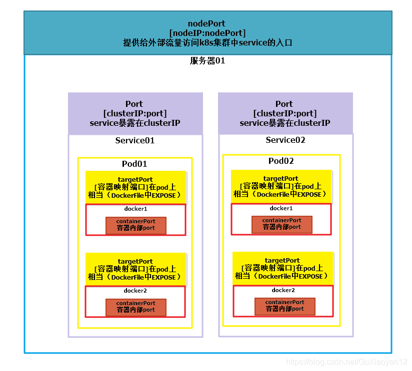

# 环境搭建

## Docker

安装Docker，[官方地址](https://docs.docker.com/docker-for-windows/install/)，要求Win10 64位以上。下载`Docker Desktop for Windows`64位版本并安装。

> 需要重启系统，有可能提示更新Windows Subsystem for Linux 2.0。

## KubeCtl

安装KuteCtl，[官网地址](https://kubernetes.io/docs/tasks/tools/install-kubectl-windows)。下载amd64bit版本，并放置到磁盘目录下，如D:\Kubernetes。

## Minikute

安装Minikute，[阿里云版本地址](https://github.com/AliyunContainerService/minikube/wiki)。下载的文件`minikube-windows-amd64.exe`，也放置到如D:\Kubernetes，并重命名为`minikube.exe`。

# 启停服务

## 启动

启动minikube。

```shell
minikube start --image-mirror-country cn --iso-url=https://kubernetes.oss-cn-hangzhou.aliyuncs.com/minikube/iso/minikube-v1.22.0.iso --registry-mirror=https://registry.docker-cn.com --vm-driver="docker" --memory=6000 
```

查看集群状态。

```shell
kubectl get nodes -o wide
```

安装启动dashboard。

```shell
 minikube dashboard
```

## 停止

删除及停止服务。

```shell
# 先删除服务
minikube delete service hello-minikube
# 再删除deployment
minikube delete deployment hello-minikube
# 最后删除minikube集群
minikube stop && minikube delete
```


# 常见操作

常见资源：

工作负载型资源(workload)： Pod，ReplicaSet，Deployment，StatefulSet，DaemonSet等。

服务发现及负载均衡型资源(ServiceDiscovery LoadBalance): Service，Ingress等等

## 负载

### 创建deployment

#### 命令方式

通过命令直接创建负载。

```shell
 kubectl create deployment my-nginx --image=nginx
```


#### 配置方式

通过yaml。

```shell
kubectl create deployment my-nginx --image=nginx --dry-run -o yaml > deployment-my-nginx.yaml
# vimi deployment-my-nginx.yaml 修改replicas为2
kubectl apply -f deployment-my-nginx.yaml
```


### 查看负载相关

1. 查看deployment

```shell
kubectl get deployment
```


2. 查看pod和service

   创建deployment之后会自动创建pod，如果pod删除后，也会自动创建。

```shell
kubectl get pods,svc -o wide
```


可以看到有一个pod/my-nginx和一个service/kubernetes，这时候端口只是在集群内部，没有暴露，所以集群外部无法访问。只能在集群内部的任一work节点访问<podIP>:<nginx容器端口80>

## 网络

### IP

- *Node IP*

  Node节点（物理机或者虚拟主机）的IP地址，即物理网卡的IP地址。


- *Cluster IP*

  Service的IP地址，此为虚拟IP地址。外部网络无法ping通，只有kubernetes集群内部访问使用。相当于同一个deployment的虚拟子网。


> 1. Cluster IP仅仅作用于Kubernetes Service这个对象，并由Kubernetes管理和分配P地址
> 2. Cluster IP无法被ping，它没有一个“实体网络对象”来响应
> 3. Cluster IP只能结合Service Port组成一个具体的通信端口，单独的Cluster IP不具备通信的基础，并且他们属于Kubernetes集群这样一个封闭的空间。
> 4. 在不同Service下的pod节点在集群间相互访问可以通过Cluster IP

- *Pod IP*

  Pod的IP地址，即docker容器的IP地址，此为虚拟IP地址。


> 1. 同Service下的pod可以直接根据PodIP相互通信
>
> 2. 不同Service下的pod在集群间pod通信要借助于 cluster ip
>
> 3. pod和集群外通信，要借助于node ip

### 端口

- *nodePort*
  nodePort是外部访问k8s集群中service的端口，通过nodeIP: nodePort可以从外部访问到某个service。

- *port(clusterPort)*
  port是k8s集群内部访问service的端口，即通过clusterIP: port可以访问到某个service。

- *targetPort(podPort)*
  targetPort是pod的端口，从port和nodePort来的流量经过kube-proxy流入到后端pod的targetPort上，最后进入容器。（相当于docker）容器暴露给容器外部访问的端口

- *containerPort*
  containerPort是pod内部容器的端口，targetPort映射到containerPort。
  

### 网络类型

- *ClusterIP* (默认)

   在集群的内部 IP 上公开 Service 。这种类型使得 Service 只能从集群内访问。

- *NodePort*

  使用 NAT 在集群中每个选定 Node 的相同端口上公开 Service 。使用`<NodeIP>:<NodePort>` 从集群外部访问 Service。是 ClusterIP 的超集。

- *LoadBalancer*

  在当前云中创建一个外部负载均衡器(如果支持的话)，并为 Service 分配一个固定的外部IP。是 NodePort 的超集。

- *ExternalName*

  通过返回带有该名称的 CNAME 记录，使用任意名称(由 spec 中的`externalName`指定)公开 Service。不使用代理。这种类型需要`kube-dns`的v1.7或更高版本。

## 创建service

将容器中的端口映射到容器外部。

```shell
# 其中port是pod的访问端口（见端口章节中的targetPort）
kubectl expose deployment my-nginx --port=80 --type=NodePort
# 删除
kubectl delete service my-nginx
```


查看service。

```shell
kubectl get svc -o wide
```


从上图可以看到ports有两个:

- 前面的为pod的端口（见前面章节中的targetPort，即容器暴露在同service的端口，可以通过<podIP>:<pod端口>访问同一个service其它pod）;
- 后面的为nodePort（因为type=NodePort，见前面章节中的nodePort，即service暴露在node之外的端口，可以通过<任意worker nodeIP>:<nodePort>）;

获取外部访问地址：

```shell
minikube service my-nginx
```


这时候就可以访问nginx了。相当于kubernates中的地址<任意worker nodeIP>:<nodePort>

```http
GET 192.168.49.2:32073
# 通信过程 192.168.49.2:32073(node) -> (10.111.207.63:clusterPort(service)暂无配置) -> 172.17.0.5:80(service任意一个pod) -> 容器内部
```


## 日志

### 查看日志

根据pod名称查看日志。

```shell
 kubectl logs my-nginx-6b74b79f57-kndkj
```


## 进入pod

```shell
kubectl exec -it my-nginx-6b74b79f57-kndkj -- bash
```

