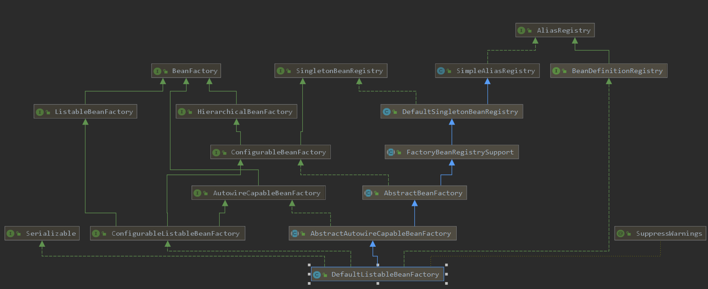
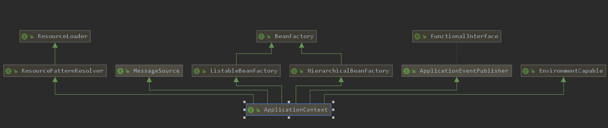
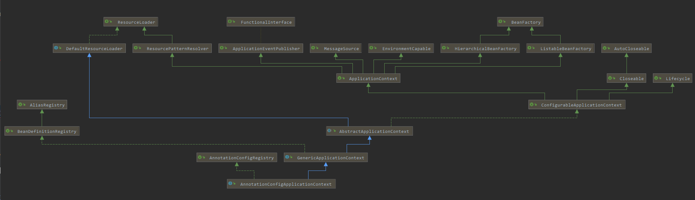
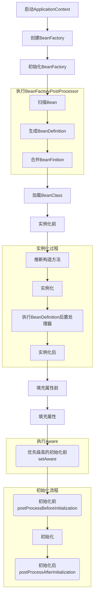

# 基本概念

## BeanDefinition

​        BeanDefinition就是bean在spring容器中的描述（配置信息），也就是bean的元数据。bean在容器扫描过程中，首先会生成BeanDefinition。常见定义bean的方式：

- <bean></bean>
- @Bean
- @Component

​        也可以通过代码方式，注册一个BeanDefinition到容器。

```java
// 定义了一个BeanDefinition
AbstractBeanDefinition beanDefinition = BeanDefinitionBuilder.genericBeanDefinition().getBeanDefinition();

// 当前Bean对象的类型
beanDefinition.setBeanClass(User.class);

// 将BeanDefinition注册到BeanFactory中
DefaultListableBeanFactory beanFactory = new DefaultListableBeanFactory();
beanFactory.registerBeanDefinition("user", beanDefinition);

// 获取Bean
System.out.println(beanFactory.getBean("user"));
```

 BeanDefinition中Bean的元数据包含：

- scope：作用域（singleton, prototype, request, session）；
- lazy：是否懒加载；
- dependsOn：依赖；
- primary：主要的装配候选标识；
- factoryBeanName：该bean生成的工厂bean名称；
- initMethodName：该bean的初始化方法名；
- destoryMethodName：该bean的销毁方法名；

### Bean解析BeanDefinition

#### BeanDefinitionReader

AnnotatedBeanDefinitionReader可以将Bean对应的类，解析为BeanDefinition。

```java
DefaultListableBeanFactory beanFactory = new DefaultListableBeanFactory();
AnnotatedBeanDefinitionReader annotatedBeanDefinitionReader = new AnnotatedBeanDefinitionReader(beanFactory);

// 将User.class解析为BeanDefinition
annotatedBeanDefinitionReader.register(User.class);

System.out.println(beanFactory.getBean("user"));
```

reader可以解析指定类，并在其构造方法中，注册6个internal后置处理器（BeanFactoryPostProcessor）。

#### ClassPathBeanDefinitionScanner

scanner可以在指定目录进行扫描@Component和@ManagedBean组件。

## BeanFactory

BeanFactory是spring的核心类，其中最重要的实现类为DefaultListableBeanFactory。



从上图可以看出，它实现和继承了众多的接口和父类。所以它具备多种能力。

1. AliasRegistry：支持别名功能，一个名字可以对应多个别名；

2. BeanDefinitionRegistry：可以注册、保存、移除、获取某个BeanDefinition；

3. BeanFactory：Bean工厂，可以根据某个bean的名字、或类型、或别名获取某个Bean对象；

4. SingletonBeanRegistry：可以直接注册、获取某个单例Bean；

5. SimpleAliasRegistry：它是一个类，实现了AliasRegistry接口中所定义的功能，支持别名功能；

6. ListableBeanFactory：在BeanFactory的基础上，增加了其他功能，可以获取所有BeanDefinition的beanNames，可以根据某个类型获取对应的beanNames，可以根据某个类型获取{类型：对应的Bean}的映射关系；

7. HierarchicalBeanFactory：在BeanFactory的基础上，添加了获取父BeanFactory的功能；

8. DefaultSingletonBeanRegistry：它是一个类，实现了SingletonBeanRegistry接口，拥有了直接注册、获取某个单例Bean的功能；

9. ConfigurableBeanFactory：在HierarchicalBeanFactory和SingletonBeanRegistry的基础上，添加了设置父BeanFactory、类加载器（表示可以指定某个类加载器进行类的加载）、设置Spring EL表达式解析器（表示该BeanFactory可以解析EL表达式）、设置类型转化服务（表示该BeanFactory可以进行类型转化）、可以添加BeanPostProcessor（表示该BeanFactory支持Bean的后置处理器），可以合并BeanDefinition，可以销毁某个Bean等等功能；

10. FactoryBeanRegistrySupport：支持了FactoryBean的功能；

11. AutowireCapableBeanFactory：是直接继承了BeanFactory，在BeanFactory的基础上，支持在创建Bean的过程中能对Bean进行自动装配；

12. AbstractBeanFactory：实现了ConfigurableBeanFactory接口，继承了FactoryBeanRegistrySupport，这个BeanFactory的功能已经很全面了，但是不能自动装配和获取beanNames；

13. ConfigurableListableBeanFactory：继承了ListableBeanFactory、AutowireCapableBeanFactory、ConfigurableBeanFactory；

14. AbstractAutowireCapableBeanFactory：继承了AbstractBeanFactory，实现了AutowireCapableBeanFactory，拥有了自动装配的功能；

15. DefaultListableBeanFactory：继承了AbstractAutowireCapableBeanFactory，实现了ConfigurableListableBeanFactory接口和BeanDefinitionRegistry接口，所以DefaultListableBeanFactory的功能很强大。

## ApplicationContext

ApplicationContext也是一种BeanFactory。



从上图可以看出，它除过实现了了BeanFactory（基础容器能力），还实现了其它接口（增强了基础业务能力和易用性）。

1. HierarchicalBeanFactory：拥有获取父BeanFactory的功能；

2. ListableBeanFactory：拥有获取beanNames的功能；

3. ResourcePatternResolver：资源加载器，可以一次性获取多个资源（文件资源等等）；

4. EnvironmentCapable：可以获取运行时环境（没有设置运行时环境功能）；

5. ApplicationEventPublisher：拥有广播事件的功能（没有添加事件监听器的功能）；

6. MessageSource：拥有国际化功能。

其中最重要的实现类为AnnotationConfigApplicationContext。



从上图可以看到，AnnotationConfigApplicationContext在ApplicationContext基础上继承和实现了一些接口及类。

1. ConfigurableApplicationContext：继承了ApplicationContext接口，增加了，添加事件监听器、添加BeanFactoryPostProcessor、设置Environment，获取ConfigurableListableBeanFactory等功能；

2. AbstractApplicationContext：实现了ConfigurableApplicationContext接口；

3. GenericApplicationContext：继承了AbstractApplicationContext，实现了BeanDefinitionRegistry接口，拥有了所有ApplicationContext的功能，并且可以注册BeanDefinition，注意这个类中有一个属性(DefaultListableBeanFactory beanFactory)；

4. AnnotationConfigRegistry：可以单独注册某个为类为BeanDefinition（可以处理该类上的@Configuration注解，已经可以处理@Bean注解），同时可以扫描；

5. AnnotationConfigApplicationContext：继承了GenericApplicationContext，实现了AnnotationConfigRegistry接口，拥有了以上所有的功能。

### 国际化

```java
// 定义一个MessageSource
@Bean
public MessageSource messageSource() {
    ResourceBundleMessageSource messageSource = new ResourceBundleMessageSource();
    messageSource.setBasename("messages");
    return messageSource;
}

// 使用国际化
annotationConfigApplicationContext.getMessage("login.info", null, new Locale("zh_CN"))
```

### 资源加载

```java
// 加载多个文件
Resource[] resources = context.getResources("classpath:application.yml");
for (Resource resource : resources) {
    System.out.println(resource.contentLength());
}
```

### 环境变量

```java
// 获取JVM所允许的操作系统的环境变量
annotationConfigApplicationContext.getEnvironment().getSystemEnvironment();

// 获取JVM本身的一些属性，包括-D所设置的命令行参数（包含classpath）
annotationConfigApplicationContext.getEnvironment().getSystemProperties();

// 增加配置文件
@PropertySource("classpath:application.yml")

// 还可以直接获取系统的环境变量，命令行参数或properties文件中的属性变量对应的属性值
annotationConfigApplicationContext.getEnvironment().getProperty("abc")

// 获取所有环境变量（systemEnvironment，systemProperties，class path resource [application.yml]）
annotationConfigApplicationContext.getEnvironment().getPropertySources()
```

### 事件发布

```java
annotationConfigApplicationContext.publishEvent("触发一个事件");
```

### 类型转换

#### PropertyEditor

该类为JDK自带的类型转换器（属性编辑器）接口，可以将外部设置值（字面量）转换为内部JavaBean属性值。可见，PropertyEditor接口方法是内部属性值和外部设置值的沟通桥梁。PropertyEditorSupport为该接口的默认实现类。

```java
static class User {
        private String name;
        public User(String name) {
            this.name = name;
        }

        @Override
        public String toString() {
            return super.toString() + this.name;
        }
    }
    static class String2UserPropertyEditor extends PropertyEditorSupport {
        @Override
        public void setAsText(String text) throws IllegalArgumentException {
            User user = new User(text);
            this.setValue(user);
        }
    }
    public static void main(String[] args) {
        PropertyEditor userPropertyEditor = new String2UserPropertyEditor();
        userPropertyEditor.setAsText("zhangsan");
        System.out.println(userPropertyEditor.getValue());
    }
}
```

输出：org.zhaoyl.Demo$User@68de145zhangsan。

也可以将该PropertyEditor注册到Spring容器中。

```java
@Bean
public CustomEditorConfigurer customEditorConfigurer() {
    CustomEditorConfigurer customEditorConfigurer = new CustomEditorConfigurer();
    Map<Class<?>, Class<? extends PropertyEditor>> propertyEditorMap = new HashMap<>();
    propertyEditorMap.put(User.class, String2UserPropertyEditor.class);
    customEditorConfigurer.setCustomEditors(propertyEditorMap);
    return customEditorConfigurer;
}

@Component
public class UserService {
	// 可以将该字面量转化为User类型，并完成属性赋值
    @Value("zhangsan")
    User user;

    public void test() {
        System.out.println(test);
    }
}
```

#### ConversionService

该接口为Spring提供，功能更为强大。

```java
public class String2UserConverter implements ConditionalGenericConverter {
    @Override
    public boolean matches(TypeDescriptor sourceType, TypeDescriptor targetType) {
        return sourceType.getType().equals(String.class) && targetType.getType().equals(User.class);
    }
    @Override
    public Set<ConvertiblePair> getConvertibleTypes() {
        return Collections.singleton(new ConvertiblePair(String.class, User.class));
    }
    @Override
    public Object convert(Object source, TypeDescriptor sourceType, TypeDescriptor targetType) {
        User user = new User((String)source);
        return user;
    }
}
public static void main(String[] args) {
    DefaultConversionService conversionService = new DefaultConversionService();
    conversionService.addConverter(new String2UserConverter());
    User value = conversionService.convert("lisi", User.class);
    System.out.println(value);
}
```

将ConversionService注册到Spring中。

```java
@Bean
public ConversionServiceFactoryBean conversionService() {
    ConversionServiceFactoryBean conversionServiceFactoryBean = new ConversionServiceFactoryBean();
    conversionServiceFactoryBean.setConverters(Collections.singleton(new String2UserConverter()));

    return conversionServiceFactoryBean;
}
```

注册完，就可以和PropertyEditor一样的属性注入。

### 后置处理器

#### BeanFactoryPostProcessor

Bean工厂的后置处理器，在Bean工厂加载Bean定义之后调用。

#### BeanPostProcessor

Bean的后置处理器，在Bean初始化前后调用（postProcessBeforeInitialization和postProcessAfterInitialization）。

#### FactoryBean

工厂Bean，用于创建Bean实例，可以使用工厂Bean间接的向容器创建Bean，可以通过实现接口BeanFactoryAware来实现。

# Bean的生命周期

Bean的生命周期，就是SpringBean在容器中的从生到死经历的各个阶段。



## Bean的生成过程

### 生成BeanDefinition

Spring在启动过程中会扫描类，并生成Class对应的BeanDefinition放置到容器中。扫描是在容器刷新是触发。调用栈如下：

```java
scanCandidateComponents:417, ClassPathScanningCandidateComponentProvider (org.springframework.context.annotation)
// 扫描ScannedGenericBeanDefinition
findCandidateComponents:316, ClassPathScanningCandidateComponentProvider (org.springframework.context.annotation)
doScan:275, ClassPathBeanDefinitionScanner (org.springframework.context.annotation)
parse:132, ComponentScanAnnotationParser (org.springframework.context.annotation)
// 开始扫描
processConfigurationClass:246, ConfigurationClassParser (org.springframework.context.annotation)
parse:203, ConfigurationClassParser (org.springframework.context.annotation)
parse:171, ConfigurationClassParser (org.springframework.context.annotation)
// 通过全配置类开始扫描路径（@ComponentScan中的basePackages）
processConfigBeanDefinitions:315, ConfigurationClassPostProcessor (org.springframework.context.annotation) // ConfigurationClassPostProcessor注册方法
postProcessBeanDefinitionRegistry:232, ConfigurationClassPostProcessor (org.springframework.context.annotation) // ConfigurationClassPostProcessor注册BD
invokeBeanDefinitionRegistryPostProcessors:275, PostProcessorRegistrationDelegate (org.springframework.context.support) // 调用BeanFactory的后置处理器之一（BD注册处理器）
invokeBeanFactoryPostProcessors:95, PostProcessorRegistrationDelegate (org.springframework.context.support) // 调用BeanFactory的后置处理器
invokeBeanFactoryPostProcessors:693, AbstractApplicationContext (org.springframework.context.support) // 调用BeanFactory的后置处理器
refresh:530, AbstractApplicationContext (org.springframework.context.support)
main:10, Application (org.zyl) // 调用refresh
```

扫描路径是@ComponentScan中的basePackages。

```java
private Set<BeanDefinition> scanCandidateComponents(String basePackage) {
		Set<BeanDefinition> candidates = new LinkedHashSet<>();
		try {
			String packageSearchPath = ResourcePatternResolver.CLASSPATH_ALL_URL_PREFIX +
					resolveBasePackage(basePackage) + '/' + this.resourcePattern;
			Resource[] resources = getResourcePatternResolver().getResources(packageSearchPath);
			boolean traceEnabled = logger.isTraceEnabled();
			boolean debugEnabled = logger.isDebugEnabled();
			for (Resource resource : resources) {
				if (traceEnabled) {
					logger.trace("Scanning " + resource);
				}
				if (resource.isReadable()) {
					try {
						MetadataReader metadataReader = getMetadataReaderFactory().getMetadataReader(resource);
						if (isCandidateComponent(metadataReader)) {
							ScannedGenericBeanDefinition sbd = new ScannedGenericBeanDefinition(metadataReader);
							sbd.setResource(resource);
							sbd.setSource(resource);
							if (isCandidateComponent(sbd)) {
								candidates.add(sbd);
							}
						}
					}
					catch (Throwable ex) {
						throw new BeanDefinitionStoreException(
								"Failed to read candidate component class: " + resource, ex);
					}
				}
			}
		}
		catch (IOException ex) {
			throw new BeanDefinitionStoreException("I/O failure during classpath scanning", ex);
		}
		return candidates;
	}
```

该方法是通过ConfigurationClassPostProcessor#postProcessBeanDefinitionRegistry，实现了接口BeanDefinitionRegistryPostProcessor，该实现继承接口BeanFactoryPostProcessor，且实现接口PriorityOrdered。因为BeanDefinitionRegistryPostProcessor执行顺序先于BeanFactoryPostProcessor，且PriorityOrdered又高于Order和其它。所有ConfigurationClassPostProcessor优先级非常高。

```java
Resource[] resources = getResourcePatternResolver().getResources(packageSearchPath);
```

resource可以通过MetadataReader生成对应Class的ScannedGenericBeanDefinition对象。此时的BeanDefinition对应的beanClass属性只是类的全限名（字符串）。

>扫描顺序是@Component（扫描路径是配置类的@ComponentScan中的basePackages），@Import（扫描路径是配置类的@Import的class），@ImportResource（根据配置的bean.xml文件），@Bean（配置类中的Bean及其父接口中的@Bean方法）。

### 合并BeanDefinition

调用栈如下：

```java
doGetBeanNamesForType:505, DefaultListableBeanFactory (org.springframework.beans.factory.support) // 合并BD
getBeanNamesForType:481, DefaultListableBeanFactory (org.springframework.beans.factory.support)
invokeBeanFactoryPostProcessors:99, PostProcessorRegistrationDelegate (org.springframework.context.support) // 在第一次扫描完BD后，再次获取最新增加的BeanDefinitionRegistryPostProcessor（如Import引入）
invokeBeanFactoryPostProcessors:693, AbstractApplicationContext (org.springframework.context.support)
refresh:530, AbstractApplicationContext (org.springframework.context.support)
main:10, Application (org.zyl)
```

由于在BeanDefinition时，可以定义（xml和代码修改BeanDefinition）继承关系，所以需要合并BeanDefinition。子BeanDefinition会继承父BeanDefinition的一些数据（包含属性值）。

```java
public void overrideFrom(BeanDefinition other) {
    if (StringUtils.hasLength(other.getBeanClassName())) {
        setBeanClassName(other.getBeanClassName());
    }
    if (StringUtils.hasLength(other.getScope())) {
        setScope(other.getScope());
    }
    setAbstract(other.isAbstract());
    setLazyInit(other.isLazyInit());
    if (StringUtils.hasLength(other.getFactoryBeanName())) {
        setFactoryBeanName(other.getFactoryBeanName());
    }
    if (StringUtils.hasLength(other.getFactoryMethodName())) {
        setFactoryMethodName(other.getFactoryMethodName());
    }
    setRole(other.getRole());
    setSource(other.getSource());
    copyAttributesFrom(other);

    if (other instanceof AbstractBeanDefinition) {
        AbstractBeanDefinition otherAbd = (AbstractBeanDefinition) other;
        if (otherAbd.hasBeanClass()) {
            setBeanClass(otherAbd.getBeanClass());
        }
        if (otherAbd.hasConstructorArgumentValues()) {
            getConstructorArgumentValues().addArgumentValues(other.getConstructorArgumentValues());
        }
        if (otherAbd.hasPropertyValues()) {
            getPropertyValues().addPropertyValues(other.getPropertyValues());
        }
        if (otherAbd.hasMethodOverrides()) {
            getMethodOverrides().addOverrides(otherAbd.getMethodOverrides());
        }
        setAutowireMode(otherAbd.getAutowireMode());
        setDependencyCheck(otherAbd.getDependencyCheck());
        setDependsOn(otherAbd.getDependsOn());
        setAutowireCandidate(otherAbd.isAutowireCandidate());
        setPrimary(otherAbd.isPrimary());
        copyQualifiersFrom(otherAbd);
        setInstanceSupplier(otherAbd.getInstanceSupplier());
        setNonPublicAccessAllowed(otherAbd.isNonPublicAccessAllowed());
        setLenientConstructorResolution(otherAbd.isLenientConstructorResolution());
        if (otherAbd.getInitMethodName() != null) {
            setInitMethodName(otherAbd.getInitMethodName());
            setEnforceInitMethod(otherAbd.isEnforceInitMethod());
        }
        if (otherAbd.getDestroyMethodName() != null) {
            setDestroyMethodName(otherAbd.getDestroyMethodName());
            setEnforceDestroyMethod(otherAbd.isEnforceDestroyMethod());
        }
        setSynthetic(otherAbd.isSynthetic());
        setResource(otherAbd.getResource());
    }
    else {
        getConstructorArgumentValues().addArgumentValues(other.getConstructorArgumentValues());
        getPropertyValues().addPropertyValues(other.getPropertyValues());
        setResourceDescription(other.getResourceDescription());
    }
}
```

### 加载类

在形成的BeanDefinition（RootBeanDefinition）后，就可以加载类了。调用栈如下：

```java
doResolveBeanClass:1403, AbstractBeanFactory (org.springframework.beans.factory.support) // 加载类
resolveBeanClass:1384, AbstractBeanFactory (org.springframework.beans.factory.support)
determineTargetType:680, AbstractAutowireCapableBeanFactory (org.springframework.beans.factory.support)
predictBeanType:647, AbstractAutowireCapableBeanFactory (org.springframework.beans.factory.support)
isFactoryBean:1518, AbstractBeanFactory (org.springframework.beans.factory.support)
doGetBeanNamesForType:511, DefaultListableBeanFactory (org.springframework.beans.factory.support) // 在所有合并过的BD中获取真实的BD的class（如factoryBean对应真实的class）
getBeanNamesForType:481, DefaultListableBeanFactory (org.springframework.beans.factory.support)
invokeBeanFactoryPostProcessors:99, PostProcessorRegistrationDelegate (org.springframework.context.support) // 在第一次扫描完BD后，再次获取最新增加的BeanDefinitionRegistryPostProcessor（如Import引入）
invokeBeanFactoryPostProcessors:693, AbstractApplicationContext (org.springframework.context.support)
refresh:530, AbstractApplicationContext (org.springframework.context.support)
main:10, Application (org.zyl)
```

通过类加载器，加载类的方法。

```java
@Nullable
private Class<?> doResolveBeanClass(RootBeanDefinition mbd, Class<?>... typesToMatch)
    throws ClassNotFoundException {

    ClassLoader beanClassLoader = getBeanClassLoader();
    ClassLoader dynamicLoader = beanClassLoader;
    boolean freshResolve = false;

    if (!ObjectUtils.isEmpty(typesToMatch)) {
        // When just doing type checks (i.e. not creating an actual instance yet),
        // use the specified temporary class loader (e.g. in a weaving scenario).
        ClassLoader tempClassLoader = getTempClassLoader();
        if (tempClassLoader != null) {
            dynamicLoader = tempClassLoader;
            freshResolve = true;
            if (tempClassLoader instanceof DecoratingClassLoader) {
                DecoratingClassLoader dcl = (DecoratingClassLoader) tempClassLoader;
                for (Class<?> typeToMatch : typesToMatch) {
                    dcl.excludeClass(typeToMatch.getName());
                }
            }
        }
    }

    String className = mbd.getBeanClassName();
    if (className != null) {
        Object evaluated = evaluateBeanDefinitionString(className, mbd);
        if (!className.equals(evaluated)) {
            // A dynamically resolved expression, supported as of 4.2...
            if (evaluated instanceof Class) {
                return (Class<?>) evaluated;
            }
            else if (evaluated instanceof String) {
                className = (String) evaluated;
                freshResolve = true;
            }
            else {
                throw new IllegalStateException("Invalid class name expression result: " + evaluated);
            }
        }
        if (freshResolve) {
            // When resolving against a temporary class loader, exit early in order
            // to avoid storing the resolved Class in the bean definition.
            if (dynamicLoader != null) {
                try {
                    return dynamicLoader.loadClass(className);
                }
                catch (ClassNotFoundException ex) {
                    if (logger.isTraceEnabled()) {
                        logger.trace("Could not load class [" + className + "] from " + dynamicLoader + ": " + ex);
                    }
                }
            }
            return ClassUtils.forName(className, dynamicLoader);
        }
    }

    // Resolve regularly, caching the result in the BeanDefinition...
    return mbd.resolveBeanClass(beanClassLoader);
}
```

### 实例化前

实例化前，是在对象被构造前执行调用的。org.springframework.beans.factory.config.InstantiationAwareBeanPostProcessor#postProcessBeforeInstantiation是该接口方法，实现该方法即可。

```java
/**
 * @param beanClass 目标对象的targetType
 * @param beanName 目标对象的beanName
 * @return 如果返回值非null，则表明在实例化前就执行了实例化，就不会调用后面的实例化过程，直接执行实例化后方法，然后中止生命周期。
 */
default Object postProcessBeforeInstantiation(Class<?> beanClass, String beanName) throws BeansException {
    return null;
}
```

该方法会在createBean时被调用。

>该方法返回非null的对象后，bean生命周期结束，执行实例化后，后续的初始化等操作都不会执行了。

### 推断构造函数

dui

### 实例化

实例化

### 执行BeanDefinition后置处理器

在实例化后，会执行BeanDefinition后置处理器org.springframework.beans.factory.support.MergedBeanDefinitionPostProcessor#postProcessMergedBeanDefinition。调用堆栈如下：

```java
applyMergedBeanDefinitionPostProcessors:1075, AbstractAutowireCapableBeanFactory (org.springframework.beans.factory.support)
// 执行BeanDefinition后置处理器
doCreateBean:567, AbstractAutowireCapableBeanFactory (org.springframework.beans.factory.support)
// 实例化Bean
createBean:515, AbstractAutowireCapableBeanFactory (org.springframework.beans.factory.support)
lambda$doGetBean$0:320, AbstractBeanFactory (org.springframework.beans.factory.support)
getObject:-1, 1489092624 (org.springframework.beans.factory.support.AbstractBeanFactory$$Lambda$12)
getSingleton:222, DefaultSingletonBeanRegistry (org.springframework.beans.factory.support)
doGetBean:318, AbstractBeanFactory (org.springframework.beans.factory.support)
getBean:199, AbstractBeanFactory (org.springframework.beans.factory.support)
preInstantiateSingletons:845, DefaultListableBeanFactory (org.springframework.beans.factory.support)
finishBeanFactoryInitialization:865, AbstractApplicationContext (org.springframework.context.support)
refresh:548, AbstractApplicationContext (org.springframework.context.support)
main:10, Application (org.zyl)
```

由于实例化已经完毕，所以该后置处理器影响不到初始化，只能影响到实例化。如可以修改PropertyValue。

```java
@Component
public class CustomerizedMergedBeanDefinitionPostProcessor implements MergedBeanDefinitionPostProcessor {

    @Override
    public void postProcessMergedBeanDefinition(RootBeanDefinition beanDefinition, Class<?> beanType, String beanName) {
        if (beanName.equals("orderService")) {
            beanDefinition.setBeanClass(OrderService.class); // useless
            beanDefinition.getPropertyValues().add("name","zhangsan");
        }
    }
}
```

### 实例化后

实例化后，是在对象被构造后执行调用的。org.springframework.beans.factory.config.InstantiationAwareBeanPostProcessor#postProcessAfterInstantiation是该接口方法，实现该方法即可。

```java
/**
 * @return false：则表示针对该bean不进行属性填充，true：表示进行后续的属性填充
 */
default boolean postProcessAfterInstantiation(Object bean, String beanName) throws BeansException {
	return true;
}
```

调用栈如下：

```java
populateBean:1369, AbstractAutowireCapableBeanFactory (org.springframework.beans.factory.support) // 填充属性前，首先调用实例化后后置处理器
doCreateBean:592, AbstractAutowireCapableBeanFactory (org.springframework.beans.factory.support)
createBean:515, AbstractAutowireCapableBeanFactory (org.springframework.beans.factory.support)
lambda$doGetBean$0:320, AbstractBeanFactory (org.springframework.beans.factory.support)
getObject:-1, 1489092624 (org.springframework.beans.factory.support.AbstractBeanFactory$$Lambda$12)
getSingleton:222, DefaultSingletonBeanRegistry (org.springframework.beans.factory.support)
doGetBean:318, AbstractBeanFactory (org.springframework.beans.factory.support)
getBean:199, AbstractBeanFactory (org.springframework.beans.factory.support)
preInstantiateSingletons:845, DefaultListableBeanFactory (org.springframework.beans.factory.support)
finishBeanFactoryInitialization:865, AbstractApplicationContext (org.springframework.context.support)
refresh:548, AbstractApplicationContext (org.springframework.context.support)
main:10, Application (org.zyl)
```

### 填充属性前

该阶段是手动注入属性及函数，调用InstantiationAwareBeanPostProcessor#postProcessProperties

```java
/**
 * 主要手工注入属性和方法（@Autowired，@Value，@Inject，@Resource）
 * @return 非null则不再调用postProcessPropertyValues；null
 */
default PropertyValues postProcessProperties(PropertyValues pvs, Object bean, String beanName) throws BeansException {
    return null;
}
```

这个接口主要有两个实现类，AutowiredAnnotationBeanPostProcessor和CommonAnnotationBeanPostProcessor。

其中AutowiredAnnotationBeanPostProcessor#postProcessProperties如下。

```java
public PropertyValues postProcessProperties(PropertyValues pvs, Object bean, String beanName) {
    // 查找该bean中@Autowired，@Value，@Inject注解的字段和方法（非static）
    InjectionMetadata metadata = findAutowiringMetadata(beanName, bean.getClass(), pvs);
    try {
        // 注入字段值（不调用属性的set方法），调用自动装配的函数（装配的注入值来自容器）
        metadata.inject(bean, beanName, pvs);
    }
    catch (BeanCreationException ex) {
        throw ex;
    }
    catch (Throwable ex) {
        throw new BeanCreationException(beanName, "Injection of autowired dependencies failed", ex);
    }
    return pvs;
}
```

其中CommonAnnotationBeanPostProcessor#postProcessProperties如下。

```java
@Override
	public PropertyValues postProcessProperties(PropertyValues pvs, Object bean, String beanName) {
    // 查找该bean中的@Resource注解的字段和方法（非static）
    InjectionMetadata metadata = findResourceMetadata(beanName, bean.getClass(), pvs);
    try {
        // 注入字段值（不调用属性的set方法），调用自动装配的函数（装配的注入值来自容器）
        metadata.inject(bean, beanName, pvs);
    }
    catch (Throwable ex) {
        throw new BeanCreationException(beanName, "Injection of resource dependencies failed", ex);
    }
    return pvs;
}
```

### 填充属性

该阶段主要是自动注入，如容器xml中<benas>配置default-autowire:byType或者byName。属性注入底层调用属性的set方法。 

### 执行aware

执行一些早期的aware。BeanNameAware，BeanClassLoaderAware，BeanFactoryAware。

### 初始化前

调用org.springframework.beans.factory.config.BeanPostProcessor#postProcessBeforeInitialization方法。可以修改bean，也可以替换bean。

### 初始化

先调用org.springframework.beans.factory.InitializingBean#afterPropertiesSet方法，在调用bean的initMethod（注解，xml或者BeanDefinition方式）

```java
@Bean(initMethod = "init",destroyMethod = "destory")	
```

### 初始化后

调用org.springframework.beans.factory.config.BeanPostProcessor#postProcessAfterInitialization。

## Bean的销毁过程

阿斯顿发送到

## 主要过程

### 依赖注入

依赖注入主要在实例化（构造函数参数注入），属性填充等阶段。方式分类：

#### 手工注入

1. set方式注入

可以通过在xml定义bean时，采用手工赋值的方式制定注入属性（实际调用的是该属性的set方法，查到该类的set方法，根据入参类型（byType）或者入参名称（byName））

```xml
<bean name="userService" class="UserService">
    <property name="orderService" ref="orderService"/>
</bean>
```

```java
class UserService {
    private OrderService orderService;
    public void setOrderService(OrderService orderService) {
        this.orderService = orderService;
    }
    public UserService(OrderService orderService) {
        this.orderService = orderService;
    }
}
```

2. 构造函数方式

   也可以通过指定构造函数参数。

```xml
<bean name="userService" class="UserService">
    <constructor-arg index="0" ref="orderService"/>
</bean>
```

3. 注解注入
   - [x] @Autowired
   - [x] @Value
   - [x] @Inject
   - [x] @Resource

#### 自动注入

1. xml指定自动注入方式

```xml
<!-- 在这里不需要指定注入哪个属性或者构造函数，会自动按照类型注入 -->
<bean id="userService" class="UserService" autowire="byType"/>
```

其中可配置的autowire类型为byType，byName，constructor，default（<beans>标签中设置default-autowire的具体类型，<bean>默认继承该配置），no（关闭自动注入）五种。指定之后，spring就可以在解析bean的类时，解析类方法，在解析UserService的属性或者方法参数，并且自动注入。

> 目前自动注入只支持xml配置方式，不支持注解方式。

#### 源码分析

依赖注入时，注入值的获取是通过接口org.springframework.beans.factory.support.DefaultListableBeanFactory#resolveDependency。

```java
/**
 * 依赖查找
 *
 * @param descriptor 依赖的描述
 * @param requestingBeanName 被注入的beanName
 * @param autowiredBeanNames 需要注入的bean
 * @param typeConverter 类型转化器
 */
@Override
@Nullable
public Object resolveDependency(DependencyDescriptor descriptor, @Nullable String requestingBeanName, @Nullable Set<String> autowiredBeanNames, @Nullable TypeConverter typeConverter) throws BeansException {

    descriptor.initParameterNameDiscovery(getParameterNameDiscoverer());
    if (Optional.class == descriptor.getDependencyType()) {
        return createOptionalDependency(descriptor, requestingBeanName);
    }
    else if (ObjectFactory.class == descriptor.getDependencyType() ||
             ObjectProvider.class == descriptor.getDependencyType()) {
        return new DependencyObjectProvider(descriptor, requestingBeanName);
    }
    else if (javaxInjectProviderClass == descriptor.getDependencyType()) {
        return new Jsr330Factory().createDependencyProvider(descriptor, requestingBeanName);
    }
    else {
        Object result = getAutowireCandidateResolver().getLazyResolutionProxyIfNecessary(
            descriptor, requestingBeanName);
        if (result == null) {
            result = doResolveDependency(descriptor, requestingBeanName, autowiredBeanNames, typeConverter);
        }
        return result;
    }
}
```

